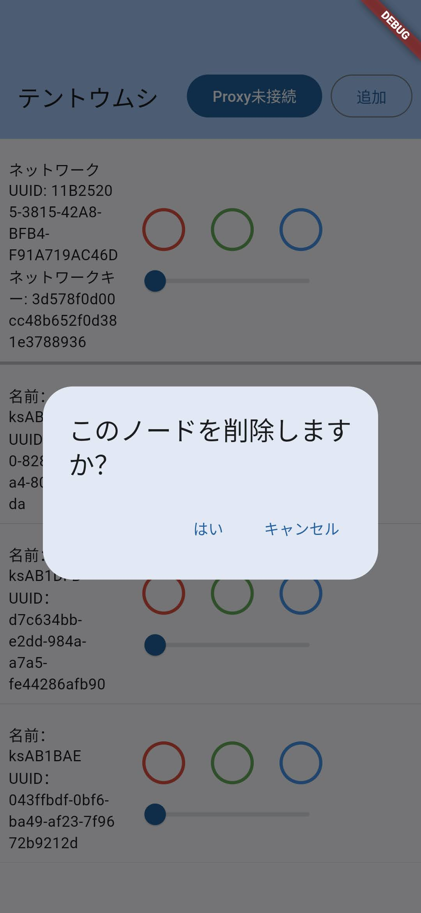
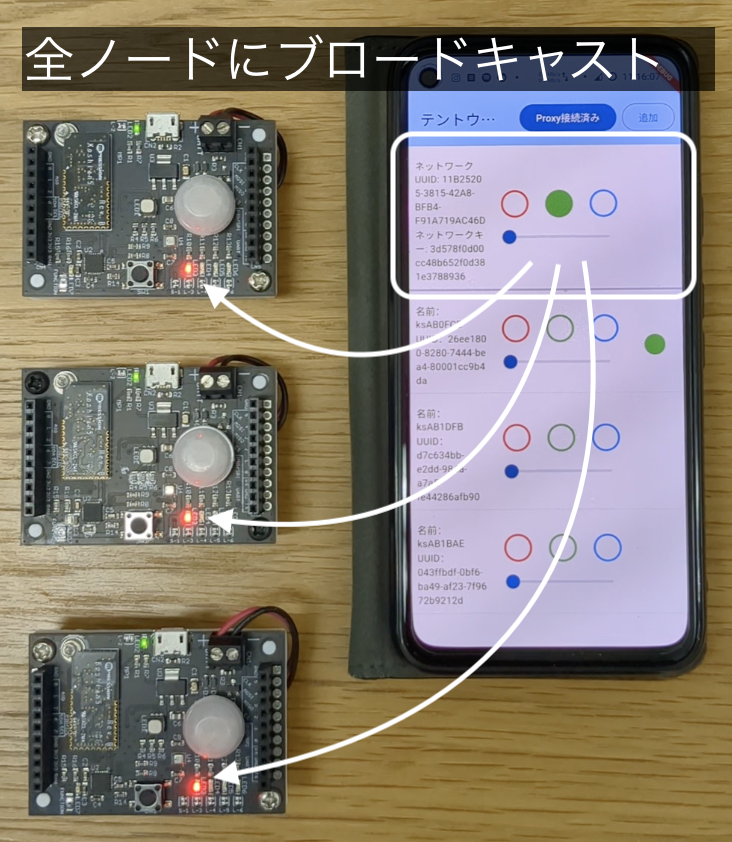

# 概要

[Koshian 5](https://www.macnica.co.jp/business/semiconductor/macnica_products/makers/143699/)をBluetooth Mesh経由で制御するデモンストレーションアプリのリポジトリです。

# Bluetooth Mesh の概要
## Bluetooth Mesh とは？
- Bluetooth 5 以降で搭載されたメッシュネットワーク通信機能です。
- 量産製品での活用事例としては、無線で連動する照明器具などに使われています。製品での活用については、これから盛り上がっていくことが期待されている技術です。
## Bluetooth Mesh の特長
### 特長１: 頑健性
- ノードの役割が動的に決まることで、ネットワークが自動修復される頑健性を備えます：
  
### 特長２: 到達距離
- マルチホップによって従来のBLEよりも到達距離を伸ばしながら双方向通信ができます：
  

## Koshian 5 の Bluetooth Mesh 機能について
- Bluetooth Mesh ネットワークはノードが受信したパケットを再度送信（`Relay`）することでネットワーク全体に行き渡らせる flood型のネットワークです。
- 典型的なスマートフォンからのBLE通信であるGATTテーブルに基づくやり取りと、Meshネットワーク上のやり取りとを仲介するノードを `Proxy` と呼びます。
- Meshネットワークにノードを追加する操作はパケットを解読するための鍵を渡すことで実現され、 `Provisioning` と呼ばれます。
- Koshian 5 は `Proxy` および `Relay` の役割を有効化することができます。
- 本アプリでは、`Proxy` ノードを経由してメッシュネットワーク上の各ノードに対してGPIO指令を行うことで、LEDやモーターなどKoshian 5の外につないだデバイスを制御します。


# アプリの使い方

アプリの機能は主に3つあります。
- 1. Meshネットワークの構築操作（Provisioning）
  - 周囲のKoshian 5をスキャンし、状態を表示したり、一つずつMeshネットワークに追加する操作が行えます。
    
  - ノード一覧でノードやネットワーク（一番上に表示された要素）をダブルタップことで、ノードをMeshネットワークから除外したり、ネットワークを破棄することができます。

    

- 2. ノードの一覧表示
  - Meshネットワークのノードを一覧表示し、Proxyの状態（スキャン中、接続済みなど）を表示します。
    この機能により、Proxyの自動切り替わり、アプリからMeshネットワークへの接続の再構築の様子が確認できます。

    

- 3. ノードに対する操作
  - 各ノードのLEDボタンとモーターのスライダーを操作すると、各ノードのLED/モータが制御できます。

    
  - ネットワーク（一番上に表示された要素）のLEDボタンやモーターのスライダーを操作すると、全ノードのLED/モータを制御できます。

    


## タミヤ「ぷるぷる・テントウムシ」に乗せてつかう場合
- [Kariya Micro Maker Faire 2024](https://makezine.jp/event/makerfaire/kmmf2024/)にて、Koshian 5のBluetooth Mesh機能のデモとして株式会社マクニカが展示を行いました。
- 展示においてはGPIO出力を[タミヤ「ぷるぷる・テントウムシ（振動移動タイプ）」](https://tamiyashop.jp/shop/g/g71117/)および外部LEDに接続する専用基板を用意し、Mesh経由でテントウムシのモーターを駆動したり、ノードの状態をLEDで表示したりするデモを行いました。

## konashi 5として使う場合
- Koshian 5をkonashi 5 ベースボードに搭載して用いる場合、アプリの緑のLEDボタンが基板上のLED1（赤色）に対応します。

# ビルド手順

## 環境構築
1. [Android Studio](https://developer.android.com/studio?hl=ja)を入手します。 [(参考)](https://qiita.com/Keisuke-Magara/items/e07055cd253881b3b4b4)
1. [FVM (Flutter Version Manager)](https://fvm.app/) を入手します。 [(参考)](https://zenn.dev/altiveinc/articles/flutter-version-management)
1. [Android Studio](https://developer.android.com/studio?hl=ja)を入手します。
    - 推奨バージョン 2023.1.1
1. 本リポジトリをcloneします。
    - ※ Submodulesのcloneを忘れずに行ってください：
      ```
      git clone git@github.com:YUKAI/koshian5_tentomushi_mesh.git --recursive
      cd koshian5_tentomushi_mesh
      ```
1. Flutter SDKを取得します。
    - 本リポジトリのフォルダ直下で以下を実行してください。
      ```
      fvm use
      ```
1. 本リポジトリのルートフォルダをAndroid Studioで開きます。
    - メインメニューから `File` > `Open` > {本フォルダ} を開きます。
1. Android Studio 上で`lib/main.dart`ファイルを開きます。
1. エディタ上部にリンクが出現したら `Install Dart plugin` を実行します。
1. エディタ上部にリンクが出現したら `Download Dart SDK` をタップします。
    - https://dart.dev/get-dart に飛ぶので記載の手順に従いDart SDKをインストールします。
1. Android Studioの右上の `⚙` または `↑` から、`SDK Manager...` をタップします。
    - サイドメニュー `Languages & Frameworks` から
      - `Android SDK` から
        - Android SDK が入っていなければ、インストール対象の端末に合わせてSDKをインストールします。
      - `Dart` から
        - `Enable Dart Support for the project ...` をチェックします。
        - `Dart SDK Path` を設定します。
          - `...` ボタンから本フォルダ以下の `.fvm/flutter_sdk/bin/cache/dart-sdk` を選択します。
            - ※ OS X で隠しフォルダが表示されない場合は `⌘ + ⇧ + G` でパスをテキスト入力します。
        - `Enable Dart support for the following modules:` から、 `Project 'koshian5_...'` にチェックを入れます。
      - `OK` で SDK Manager を閉じます。
1. Android Studioの右上の `⚙` または `↑` から、`Plugins...` をタップします。
    - 表示されたプラグインから `Flutter` をインストールします。
    - `Restart IDE` で Android Studio を再起動します。
1. Android Studioの右上の `⚙` または `↑` から、`SDK Manager...` をタップします。
    - サイドメニュー `Languages & Frameworks` から
      - `Flutter` から
        - `Flutter SDK Path` を設定します。
          - `...` ボタンから本フォルダ以下の `.fvm/flutter_sdk` を選択します。
      - `OK` で SDK Manager を閉じます。
## ビルド
1. Android Studioのメインメニューから `Build` > `Flutter` > `Build APK` でビルドします。
    - 以下のように出力されればビルド成功です。
      ```
      ✓  Built build/app/outputs/flutter-apk/app-release.apk (xx.xMB).
      Process finished with exit code 0
      ```

## 実行
1. デバッグ対象の端末で開発者オプションを有効化します。
    - Google Pixelの例） `設定` > `デバイス情報` > `ビルド番号` を数回連続してタップしてPINナンバーを入力して有効化します。
1. USBデバッグを有効化します。
    - `設定` > `システム` > `開発者向けオプション` > `USB デバッグ` をON
1. PCに接続します。
    - 端末に`USB デバッグを許可しますか？`と出るので許可します。
1. Android Studioで `▶` 実行ボタンをタップします。
    - （ここは時間がかかります）
1. 無事に実行できると `Koshianテントウムシ` というアプリがインストールされます。

